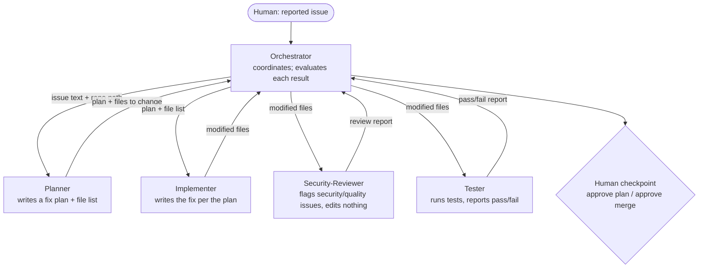

# Orchestration Diagram — Appointment-App Backend Fix Pipeline

The Orchestrator coordinates a bounded team to review and fix a reported backend issue in the
appointment-scheduling app (Flask + MySQL backend, React frontend). It delegates each phase to a
scoped subagent, evaluates each result, loops back or escalates, and stops at human checkpoints.

## Flow

1. **Orchestrator** receives the reported issue and coordinates the run (delegates, evaluates,
   never writes code itself).
2. **Planner** (read-only) — issue + code in, fix plan + file list out.
3. **Implementer** (read/write) — plan in, modified files out.
4. **Security-Reviewer** (read-only) — modified files in, review report out.
5. **Tester** (test-runner) — modified files in, pass/fail out.

## Evaluation checkpoints
The Orchestrator checks each result before proceeding. If the Reviewer reports any Critical issue
or the Tester reports failures, it loops back to the Implementer. It halts at a human checkpoint
after the Planner (approve the plan before code) and before any change is finalized.

<!-- ALT TEXT: Top-down diagram. A human reports an issue to the Orchestrator, which delegates in
sequence to Planner (issue+code -> plan+files), Implementer (plan -> modified files),
Security-Reviewer (modified files -> review report), and Tester (modified files -> pass/fail). The
Orchestrator evaluates each result, loops back to the Implementer on Critical review findings or
test failures, and pauses at human checkpoints to approve the plan and the final change. -->
