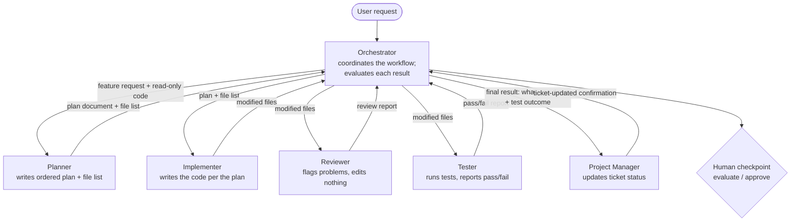

# Orchestration Diagram

This diagram shows how the Orchestrator coordinates the subagent team for a multi-phase feature
workflow (illustrated with the "Add CSV Export" example). The Orchestrator receives the initial
request, delegates each phase to a specialized subagent, evaluates each result, and decides whether
to continue, route back for revision, or escalate to a human.

## How the workflow flows

1. The **Orchestrator** receives the user's feature request and coordinates the whole run. It does
   not do the work itself -- it delegates, evaluates each returned result, and decides what happens
   next (continue, send back for revision, or escalate to a human).
2. **Planner** -- receives the feature request + read-only code; returns an ordered plan and the
   list of files to change. Tools: file read + code search. Autonomy: High.
3. **Implementer** -- receives the plan + file list; returns the modified files. Tools: file
   read/write + code search. Autonomy: Medium.
4. **Reviewer** -- receives the modified files; returns a review report. Tools: read-only (file
   read + code search). Autonomy: High for reading; never edits.
5. **Tester** -- receives the modified files; returns a pass/fail report. Tools: file read + test
   runner. Autonomy: Medium.
6. **Project Manager** (tool-scoping role) -- receives the final assembled result; updates the
   ticket and returns confirmation. Tools: ticket-tracking tool only. Autonomy: Medium. Isolating
   the ticket tool here keeps it out of every other agent's context and prevents premature ticket
   changes.

## Evaluation checkpoints

The Orchestrator evaluates each subagent's output before proceeding. If the Reviewer reports
problems or the Tester reports failures, the Orchestrator can route the work back to the
Implementer for revision rather than continuing. A human checkpoint is used before the run is
considered complete (and before any shared record like the ticket is finalized).

<!--
ALT TEXT (shown if the diagram image cannot load):
A top-down orchestration diagram. At the top, a User request flows into the Orchestrator. The
Orchestrator delegates in sequence to five subagents, each with a labeled round-trip: Planner
(receives feature request + read-only code, returns a plan + file list), Implementer (receives plan
+ file list, returns modified files), Reviewer (receives modified files, returns a review report),
Tester (receives modified files, returns a pass/fail report), and Project Manager (receives the
final result, returns ticket-updated confirmation). The Orchestrator evaluates each result and can
route work back for revision or escalate to a human checkpoint before completion.
-->